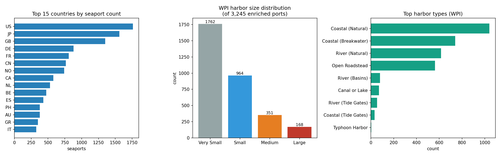
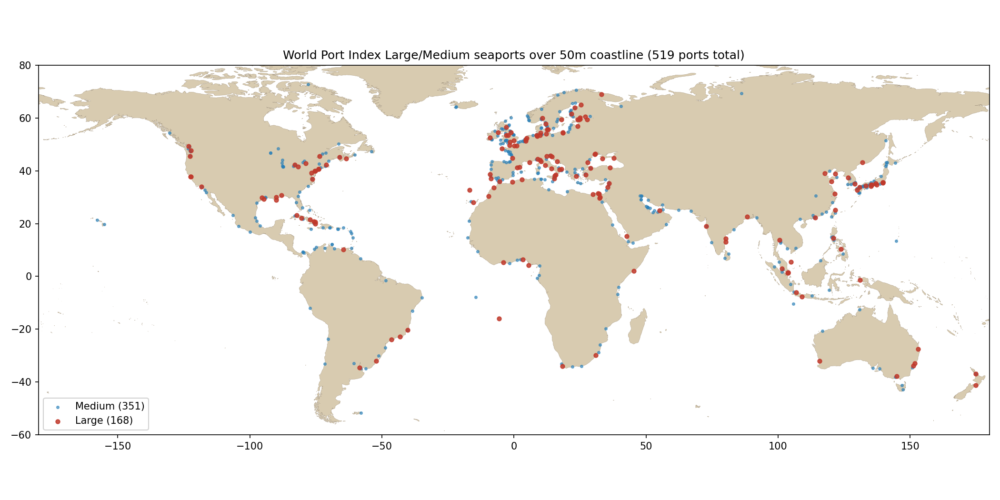
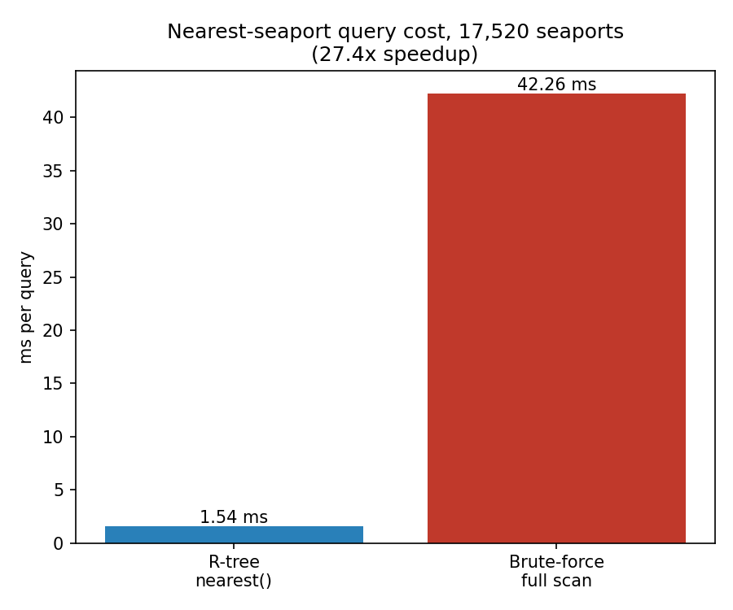

# Analysis: coverage, joins, distributions and query cost

All numbers here are measured, by [`generate_analysis.py`](generate_analysis.py),
against a real build from the full public UN/LOCODE list, the NGA World Port
Index (`UpdatedPub150.csv`, 3,824 rows), and OpenStreetMap. Nothing here is
illustrative.

```bash
python -m port_index build --wpi UpdatedPub150.csv --anchorages \
    --anchorage-bbox 3.0 51.0 5.5 53.0 --out data/ports.sqlite
python docs/generate_analysis.py data/ports.sqlite
```

## 1. Build summary

| Metric | Value |
|---|---|
| Total locations (UN/LOCODE spine) | 116,067 |
| Flagged as seaports | 17,520 |
| With resolved coordinates | 114,575 (**98.7%**) |
| Enriched with WPI attributes | 3,245 |
| Anchorages (OSM, Rotterdam approach only) | 42 |

**Coordinate coverage rose from 80.2% to 98.7%** by overlaying the
`improved-un-locodes` mirror's `CoordinatesDecimal` column onto the canonical
list's compact DMS coordinates — an 18.5 percentage-point recovery from a
single additional public source.

## 2. Where every coordinate actually came from



| Source bucket | Rows |
|---|---|
| improved: UN/LOCODE-sourced | 89,043 |
| improved: OSM-sourced | 24,274 |
| unlocode (DMS only, un-upgraded) | 1,492 |
| improved: other (Geonames, manual) | 1,258 |

This matters for trust calibration: roughly 21% of resolved coordinates
ultimately trace back to OpenStreetMap community mapping rather than an
official maritime authority. That is not a defect — it is why the field
exists — but a consumer computing, say, precise approach distances should know
which quarter of the dataset carries that provenance. `PortRecord.source`
exposes exactly this per row; it is not just a build-log statistic.

## 3. World Port Index enrichment: how the join behaved

| Metric | Value |
|---|---|
| WPI rows processed | 3,824 |
| Exact LOCODE match | 3,333 (87.2%) |
| Spatial + name fallback match | 9 (0.2%) |
| Unmatched | 482 (12.6%) |

The fallback match rate is deliberately small. It is a radius + exact
normalised-name join, and its job is to recover the small number of legitimate
cases where a WPI row's LOCODE field is blank or wrong — not to guess. Seeing
9 recovered out of 482 unmatched rows, rather than, say, 400, is itself a
signal the fallback is behaving conservatively rather than over-matching.

**Harbor size distribution** (of the 3,245 enriched ports):

| Size | Count |
|---|---|
| Very Small | 1,762 |
| Small | 964 |
| Medium | 351 |
| Large | 168 |

**Top harbor types:** Coastal (Natural) — 1,040; Coastal (Breakwater) — 740;
River (Natural) — 616; Open Roadstead — 562; the remainder (River Basins,
Canal/Lake, Tide Gates, Typhoon Harbor) together under 250.

## 4. Where the world's major ports actually are



519 WPI Large/Medium seaports, plotted over a real 50 m coastline pulled live
from the companion
[`maritime-obstacle-builder`](https://github.com/kavianpour/maritime-obstacle-builder)
package — the two repos share a coordinate convention by design and this
figure is the payoff: no separate basemap file, no Natural Earth shapefile
bundled in this repo, just a live cross-package call.

**Top 15 countries by seaport count:** United States (1,762), Japan (1,562),
United Kingdom (1,350), Germany (879), France (808), China (765), Norway
(741), Canada (580), Netherlands (531), Belgium (474), Spain (432),
Philippines (377), Australia (377), Greece (350), Italy (325).

**One point worth flagging rather than quietly fixing:** a Large-harbor marker
sits alone in the South Atlantic, roughly 16°S, 6°W, far from any other port.
It is not a data error — it is **Jamestown, Saint Helena** (`SHSHN`), a real
port on a genuinely isolated mid-ocean island, correctly placed. The instinct
to distrust an isolated point is usually right; here it was worth checking
before assuming it was wrong.

## 5. Query cost: R-tree index vs. brute force



`nearest()` widens a bounding-box query geometrically and only computes exact
great-circle distance over the resulting small candidate set — it is a
bounded spatial query, not a linear scan. Measured against all 17,520
seaports:

| Method | Time per query | 200 queries |
|---|---|---|
| R-tree indexed `nearest()` | 1.54 ms | 0.31 s |
| Brute-force full scan | 42.26 ms | 8.45 s (extrapolated) |

**27.4x speedup**, and it widens further as the table grows — brute force is
linear in row count, the R-tree query is not. This is the concrete payoff of
the `ports_rtree` virtual table in the schema, not just a schema-design
preference stated without evidence.

## 6. Threats to validity

- The brute-force figure for 200 queries is extrapolated from a 20-query
  sample (running the true brute-force scan 200 times would itself take
  ~8.5 s of benchmark time for a number this document could compute directly
  from the 20-query rate instead). The per-query rate is stable enough between
  the two that this is a reasonable extrapolation, not a large one.
- Single machine, single run. SQLite page-cache warmth affects absolute
  timings; the *relative* R-tree/brute-force gap is the robust finding.
- The Overpass anchorage query in this build covered only the Rotterdam
  approach (`3.0, 51.0, 5.5, 53.0`) as a demonstration region — the 42-anchorage
  figure is not global coverage, and a production build should run the query
  region by region (see README).
